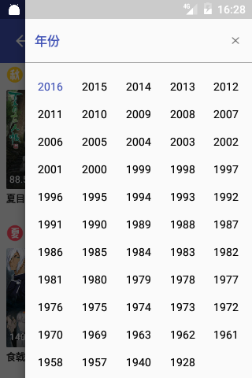
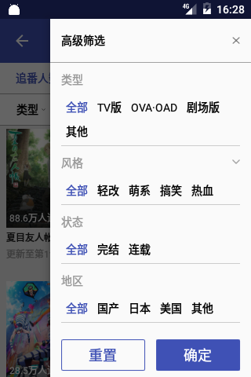
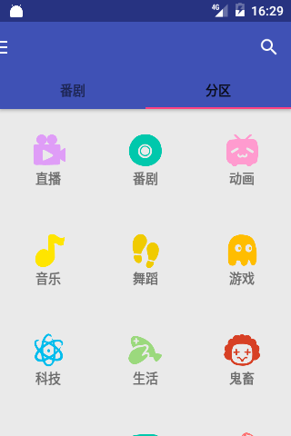

## 高仿BiliBili安卓客户端

## 介绍

### 已完成的功能

* 1.番剧，分区的实现。

* 2.番剧播放界面，视频播放界面

* 3.番剧详情页面的实现，视频详情页面的实现

## Screenshots

 

 

 

 

 

 

 

### 感谢以下开源库

* [okhttp](https://github.com/square/okhttp)
* [retrofit](https://github.com/square/retrofit)
* [ijkplayer](https://github.com/Bilibili/ijkplayer)
* [butterknife](https://github.com/JakeWharton/butterknife)
* [glide](https://github.com/bumptech/glide)
